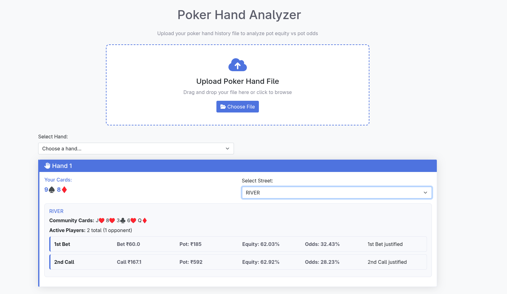

This was something I was working on for myself, but after PokerStars got banned in Tamil Nadu I though of open sourcing so someone might benefit and Gamble better.  

(Please dont take this seriously, its a joke-obviously, Poker is'nt Gambling :)

[Access it here](https://pokerbizz.onrender.com/)  
Currently it works only with PokerStars -I've added a sample file in the repo.[hands.txt].It doesn't have streaming/multithreading so uploading large files with more hands might  
 take upto 2 minutes
## What It is

It's very simple. It's a dumb website (No ML) with a vibecoded frontend where you can upload your Poker hand history from your online sessions.
What it will do is show you the pot odds and pot equity for each of your calls/bets/raises, for all your hands and all streets (PREFLOP, FLOP, TURN, RIVER)-where you bet.

It has python backend with a Flask framework and HTML frontend



I've used a monte carlo sim that runs your hand against the largest amount of possible callers and the current board - 10,000 times. 
Your total score is(Pot equity):
```math

    \frac{(\text{Wins} \times 1.0) + \sum_{i=1}^{n} \frac{1}{t_i}}{10000}

```

Here $t_i$ is the number of villians you tied with in that round.

## Pot Odds

For Call and Bet:
```math
     
    \frac{Call\_Amount}{Call\_Amount + Pot\_Amount(before Call)}
```

For Raise:
```math
     
     \frac{Raise\_Amount}{Raise\_Amount + Pot\_Amount(before Raise)}
```

## Justified call

Call/bet/raise is justified when:


```math
    Pot\_Odds<=Pot\_Equity
```
## Future 

Could possibly add weights and position influence. Currently its based on pure math and no villain ranges. This can be done through ML.


